# 🎬 InstaReels Code Gallery

## 🌟 What is this repository for?

This repository contains my collection of source codes for **Instagram Reels and TikTok content**. Each project here is crafted specifically to look beautiful, run smoothly, and showcase dynamic coding sequences or frontend/backend capabilities in a visually engaging and cinematic way.

Most of the projects simulate **live-coding workflows**. They are deliberately designed to progressively build from simple structures to stunning final products through layers of styling or interactivity, perfectly optimized for screen recordings and short-form video content.

---

## 📂 Projects Overview

### 1. `reel-login-page/`

A modern, glassmorphism-styled login page built from scratch. It features rich CSS animations, dynamic visual effects, and a sleek layout designed to progressively become "premium" as layers of CSS are added in steps.

### 2. `stayWithMe/`

A more complex Python-based backend architecture project featuring visually clean output, synced workflows, and sophisticated logic routines.

> _"Code should be as beautiful as the products it creates." ✨_
